# Gaussian elimination (partial pivot)

## Complete explanation
[Wikipedia](https://en.wikipedia.org/wiki/Gaussian_elimination)

## Brief explanation

Gaussian elimination (also known as Gauss-Jordan elimination or row reduction) is an algorithm in linear algebra for solving a system of linear equations.  
To perform row reduction on a matrix, a sequence of elementary row operations are used to modify the matrix until the lower left-hand corner of the matrix is filled with zeros, as much as possible. There are three types of elementary row operations:
- Swapping two rows
- Multiplying a row by a nonzero number
- Adding a multiple of one row to another row

If the system of equation is solvable and admits only one solution vector, the matrix can be reduced to an upper triangular matrix.  
Once in this form, the system can be solved easily with some substitutions.

---

## OpenCL implementations

There are 3 main parts that represent a challenge in the OpenCL implementation:

- choosing as a pivot the row with the greater absolute value in the column of index **pivot**, and if it is not the row of index **pivot** swap them.
    - This translates in an search problem that is not embarrassingly parallel, followed by a the possible swap of two rows that must be synchronized for all work-items for the following steps to work properly.

- each time a new pivot of index **i** has been chosen, the following **n - i - 1** reductions depend on the previous step of the algorithm.
    - To make it clearer, let's say we have to solve a system of **n** unknowns in **n** equations.  
    - For each iteration, we choose a pivot row and column and reduce all the other rows that have not been chosen has pivots before, following the rules stated in the explanation. Once we are done, we repeat the procedure with the new values obtained in this step.  
    - To simplify even more, assume we are lucky enough to be allowed to chose these pivot rows and columns in order, from the row **0** to the row **n-1**.
    - In practice the i-th step of the algorithm needs the sub-matrix with origin (**i**, **i**) and size (**n - i** X **n - i + 1**) as input.
    - Since there is no way to force synchronization in the global memory, the only two options I see are to either launch "rows - 1" kernel plus the one to finalize the result vector or, alternatively, to store the whole matrix in local memory.

- calculating the result vector needs synchronization between rows, since the row of index **i** needs the result produced by the row **i + 1**
    - This is because, since the result of the algorithm is an upper triangular matrix, only the last unknown can be obtained directly, while the others depend on the previous ones.
    - On the flip-side, the action of summing all the previous solution, multiplied with the correct coefficient, can be achieved in O(log(n)) time instead of the usual O(n) by taking advantage of some parallelization.

### **Partial pivot texture**

In this implementation of the Gaussian elimination the pivot row is the one that contains the greater absolute value in the pivot column.  
If the newly found pivot row is not the one the first row of the sub-matrix, the two rows are swapped.

The whole matrix is stored in a texture. Another one with the same dimensions is created. The two textures are used alternately as input or output, a ping pong of sorts, meaning there is the need to lauch **n - 1** kernels.  
The result is that the odd reduced rows will be on one texture, while the even ones will be on the other, exept for the last row, that will be in the opposite texture.

The parallelization concerns the fact that the max value and its index are calculated in a logaritmic time and each work-item will calculate one item of the sub-matrix.

_In the output texture the pivot row is written as the first available row, effectively swapping them if it was not the first_  
_Every other frame is a different kernel_

To calculate the result vector, a buffer of size 2n is allocated in the local memory.  
For each row, the corresponding unknown's value is calculate, storing the temporary calculations in the first half of the buffer, while the **n** solutions are stored in the second half.

**Number of kernels launched: O(n)**  
**Local memory used: O(n)**  
**Time complexity: O(nlog(n))**  
**Spatial complexity: O(n^2)**  

| :heavy_check_mark: Pro | :x: Cons |
| - | - |
| The parallelization improves the time complexity | Needs to launch n kernels, with all the overhead this entails |
| Can exploit the strong caching enjoyed by the textures | The use of a texture allows only floats to be used, excluding doubles |

**Conclusion:** this approach is bery fast for big inputs and has the benefits of using pivoting, with the only limitation of working only on floats.

### **Partial pivot buffer**

In this implementation of the Gaussian elimination the pivot row is the one that contains the greater absolute value in the pivot column.  
If the newly found pivot row is not the one the first row of the sub-matrix, the two rows are swapped.

The whole matrix is stored in a buffer. Another one with the same dimensions is created. The two buffers are used alternately as input or output, a ping pong of sorts, meaning there is the need to lauch **n - 1** kernels.  
The result is that the odd reduced rows will be on one buffer, while the even ones will be on the other.

The parallelization concerns the fact that each work-item will calculate one item of the sub-matrix.  

_In the output buffer the pivot row is written as the first available row, effectively swapping them if it was not the first_  
_Every other frame is a different kernel_

To calculate the result vector, a buffer of size 2n is allocated in the local memory.  
For each row, the corresponding unknown's value is calculate, storing the temporary calculations in the first half of the buffer, while the **n** solutions are stored in the second half.

**Number of kernels launched: O(n)**  
**Local memory used: O(n)**  
**Time complexity: O(nlog(n))**  
**Spatial complexity: O(n^2)**  

| :heavy_check_mark: Pro | :x: Cons |
| - | - |
| The parallelization improves the time complexity | Needs to launch n kernels, with all the overhead this entails |
| The solution, when found, is as exact as it can get | |

**Conclusion:** this approach is not the fastest, but being based on a buffer leaves more room for the customization of the type of input and is the most "general purpose".

---

[Back to table of contents](Table-of-contents.md)