# Gaussian elimination

## Complete explanation
[Wikipedia](https://en.wikipedia.org/wiki/Gaussian_elimination)

## Brief explanation

Gaussian elimination (also known as Gauss-Jordan elimination or row reduction) is an algorithm in linear algebra for solving a system of linear equations.  
To perform row reduction on a matrix, a sequence of elementary row operations are used to modify the matrix until the lower left-hand corner of the matrix is filled with zeros, as much as possible. There are three types of elementary row operations:
- Swapping two rows
- Multiplying a row by a nonzero number
- Adding a multiple of one row to another row

If the system of equation is solvable and admits only one solution vector, the matrix can be reduced to an upper triangular matrix.  
Once in this form, the system can be solved easily with some substitutions.

---

## OpenCL implementations

The challenge of an OpenCL implementation arise from the fact that to set to zero all the values below the pivot, it is necessary to do some calculation depending on the pivot row.  
The issue is that this process is to be repeated "rows" times, and the pivot row has to be the one calculated with the last iteration.

To make it clearer, let's say we have to solve a system of **n** unknowns in **n** equations.  
For each iteration, we choose a pivot row and column and reduce all the other rows that have not been chosen has pivots before, following the rules stated in the explanation. Once we are done, we repeat the procedure with the new values obtained in this step.  
To simplify even more, assume we are lucky enough to be allowed to chose these pivot rows and columns in order, from the row **0** to the row **n-1**.
It's easy to see that the i-th step of the algorithm has as input the sub-matrix with origin (**i**, **i**) and size (**n - i** X **n - i + 1**).

Since there is no way to force synchronization in the global memory, the only two options I see are to either launch "rows - 1" kernel plus the one to finalize the result vector or, alternatively, to store the whole matrix in local memory.

### **No pivot lmem**

Simplest implementation of a Gaussian elimination where the pivots are chosen in based on the order of rows.  
The whole matrix is stored in the local memory of size (**n + 2** X **n + 1**) and all the work-items belong to the same work-group, so that they share the same local memory.

The parallelization only concerns the fact that the work-items go through each row in parallel, each on a specific column.

Finally, for each row the corrisponding unknown's value is calculate, storing the temorary calculations in one row, while the **n** solutions are stored in the other.

**Number of kernels launched: O(1)**  
**Local memory used: O(n^2)**  
**Time complexity: O(n^2)**  
**Spatial complexity: O(n^2)**  

| :heavy_check_mark: Pro | :x: Cons |
| - | - |
| The theory behind is easy to grasp | Not efficient at all |
| The solution, when found, is as exact as it can get | The "no pivot" version may not be able to solve some solvable systems |
| | Then dimension of the matrix is limited by the amount of local memory available to the work-group |

### **No pivot tex**

Simplest implementation of a Gaussian elimination where the pivots are chosen in based on the order of rows.  
The whole matrix is stored in a texture. Another one with the same dimensions is created. The two textures are used alternately as input or output, a ping pong of sorts.  
The result is that the odd reduced rows will be on one texture, while the even ones will be on the other.

The parallelization concerns the fact that each work-item will calculate one item of the sub-matrix.  
_Each frame is a different kernel_

To calculate the result vector, a buffer of size 2n is allocated in the local memory.  
For each row, the corrisponding unknown's value is calculate, storing the temorary calculations in the first half of the buffer, while the **n** solutions are stored in the second half.

**Number of kernels launched: O(n)**  
**Local memory used: O(n)**  
**Time complexity: O(n^2)**  
**Spatial complexity: O(n^2)**  

| :heavy_check_mark: Pro | :x: Cons |
| - | - |
| The theory behind is easy to grasp | Needs to lauch n kernels, with all the overhead this entails |
| Can exploit the strong caching enjoyed by the textures | The "no pivot" version may not be able to solve some solvable systems |
| | The use of a texture allows only floats to be used, excluding doubles |

### **No pivot buffer**

Simplest implementation of a Gaussian elimination where the pivots are chosen in based on the order of rows.  
The whole matrix is stored in a buffer. Another one with the same dimensions is created. The two buffers are used alternately as input or output, a ping pong of sorts.  
The result is that the odd reduced rows will be on one buffer, while the even ones will be on the other.

The parallelization concerns the fact that each work-item will calculate one item of the sub-matrix.  
_Each frame is a different kernel_

To calculate the result vector, a buffer of size 2n is allocated in the local memory.  
For each row, the corrisponding unknown's value is calculate, storing the temorary calculations in the first half of the buffer, while the **n** solutions are stored in the second half.

**Number of kernels launched: O(n)**  
**Local memory used: O(n)**  
**Time complexity: O(n^2)**  
**Spatial complexity: O(n^2)**  

| :heavy_check_mark: Pro | :x: Cons |
| - | - |
| The theory behind is easy to grasp | Needs to lauch n kernels, with all the overhead this entails |
| The solution, when found, is as exact as it can get | The "no pivot" version may not be able to solve some solvable systems |
---

[Back to table of contents](Table-of-contents.md)